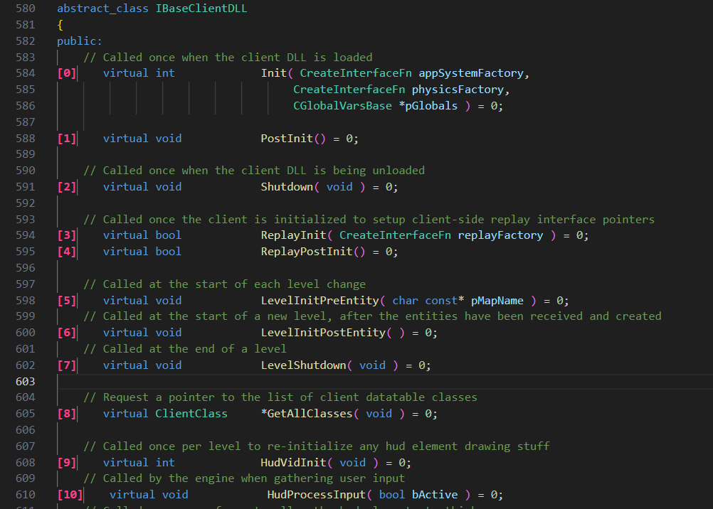

# Virtual Counter

Virtual Counter is a Visual Studio Code extension that counts the number of virtual functions in a file and adds a number next to each virtual function visually using decorations. It provides a quick overview of the virtual functions in your code and their respective classes.

## Features

- Counts the virtual functions in the currently opened file.
- Adds a visual number next to each virtual function using decorations.

## Usage

1. Open a file containing C++ code with virtual functions.
2. Use the `virtual-counter.countVirtualFunctions` / `Count Virtual Functions` command from the Command Palette (`Ctrl+Shift+P` or `Cmd+Shift+P`) to count the virtual functions and add the numbers.
3. The virtual functions will be visually marked with a number next to them.

## Screenshot

## Installation

1. Launch Visual Studio Code.
2. Go to the Extensions view (Ctrl+Shift+X or Cmd+Shift+X).
3. Search for "Virtual Counter" and click **Install**.
4. Restart Visual Studio Code.

## Extension Settings

This extension doesn't have any configurable settings at the moment.

## Known Issues

- None.

## Contribution

Contributions are welcome! If you encounter any issues or have suggestions for improvements, please feel free to open an issue or submit a pull request on the [GitHub repository](https://github.com/zphrus/virtual-counter).

## License

This extension is licensed under the [MIT License](LICENSE).
